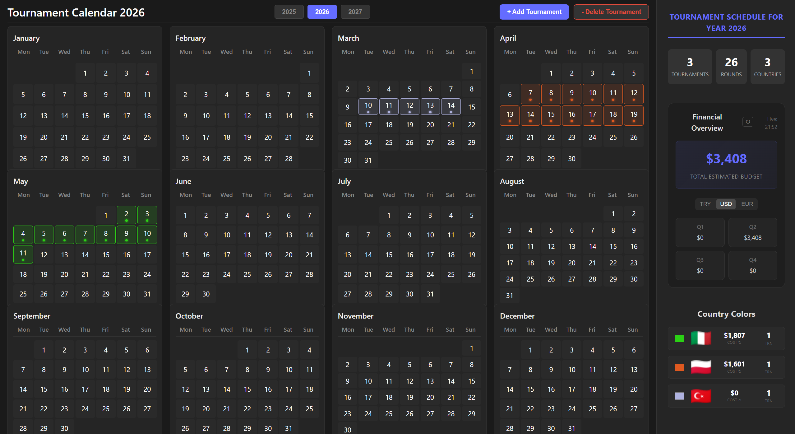

# Tournament Calendar 2026

A modern web application for chess tournament scheduling, expense tracking, and financial analysis.

## Key Features
- **Interactive Calendar**: Plan tournaments across 2025-2027.
- **Budget Tracking**: Detailed expense breakdown per tournament.
- **Live Currency**: Real-time exchange rates (FxRatesAPI) for TRY, USD, and EUR.
- **Financial Overview**: Quarterly analysis and per-country cost summaries.

## Getting Started

### Prerequisites
- Node.js (v18+)

### Installation
1. `npm install`
2. Create `.env` with `VITE_FXRATES_API_KEY=YOUR_ACCESS_TOKEN`
3. `npm run dev`

---
Built with React, TypeScript, and Vite.
