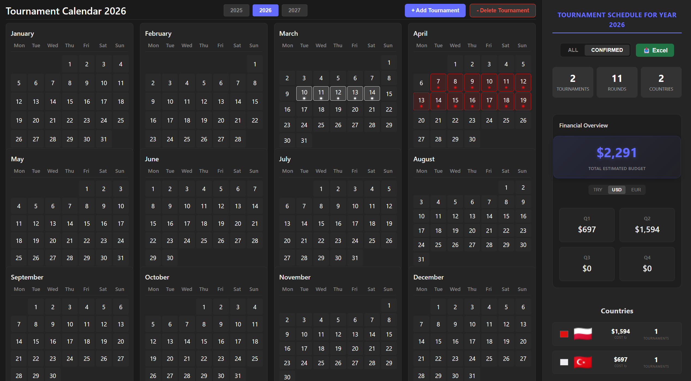
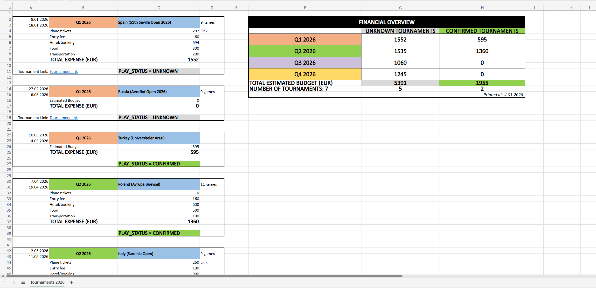
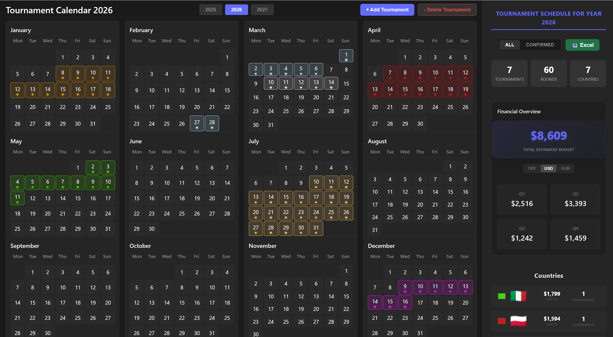

# Tournament Calendar 2026

A modern web application for chess tournament scheduling, expense tracking, financial analysis, and advanced Excel reporting.

## Key Features
- **Interactive Calendar**: Plan tournaments across 2025-2027 with "Confirmed" vs "ALL" participation tracking.

- **Advanced Excel Export**: Generate professional financial reports.
  
  - **Financial Matrix**: Quarterly breakdown with color-coded layouts.
  - **Status Analysis**: Split budgets by "Confirmed" vs. "ALL" tournaments.
  - **Dynamic Currency**: Automatic conversion to TRY, USD, or EUR.

- **Smart Dashboard**:
   
  - Real-time financial overview with **"All" vs "Confirmed"** filtering.
  - Country-based expense tracking with flag integration.
- **Budget Management**: Flexible planning with "Basic" (lump sum) or "Detailed" (itemized expenses) modes.
- **Live Currency**: Automatic daily exchange rate updates via FxRatesAPI.

## Getting Started

### Prerequisites
- Node.js (v18+)

### Installation
1. `npm install`
2. Create `.env` with `VITE_FXRATES_API_KEY=YOUR_ACCESS_TOKEN`
3. `npm run dev`

---
Built with React, TypeScript, and Vite.
